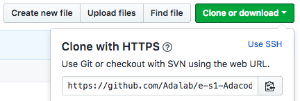
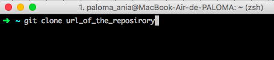
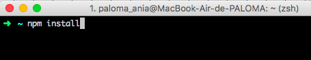

This repository gives access to a web which is the first project of ADACODERS team. Our team is formed by five enthusiastic women from Adalab environment, a foundation that promotes women working at tech and programming.

You can enter our website to discover more about us, about ADACODERS and who we are and what are we interested in. Furthermore, entering the website you will have the possibility to contact us.

>### ENTER ADACODERS WEBSITE: http://beta.adalab.es/e-s1-Adacoders/

# Little guide to use this repository in your computer:
1. Clone the repository from GitHub in your computer. Copy the repo link and paste it in your terminal after the command *git clone*, then press enter.




2. Write **npm install** and press enter, in order to activate the **Gulp tasks** that are included in the “Adalab web starter kit” which contains gulp tasks.



3. After these steps, your cloned repository is ready to use! And please don’t forget to make a “pull request” of your branch with modifications. Thanks ;)

# How to use the “Adalab starter kit” gulp package included in the repository:

## Adalab web starter kit
Ahoy! Esta es nuestro Starter Kit en node/gulp para este primer contacto con el desarrollo web
Incluye SCSS, un sistema de plantillas HTMl y un web server.

## Guía de inicio rápido
Necesitarás instalar [Node.js](https://nodejs.org/) y [Gulp](https://gulpjs.com) para trabajar con este Starter Kit, luego:
1. Descarga o clona el repositorio
2. Instala las dependencias locales con `$ npm install`
3. Arranca el kit con `$ gulp`

## Espera, ¿esto se hace siempre?
> ### Solo una vez al principio en cada ordenador que utilicemos:
- Instalamos node
- Instalamos el comando de gulp de forma global para poder usarlo desde cualquier carpeta usando `npm install --global gulp-cli`

> ### Cada vez que descarguemos o clonemos un repo:
- `npm install` para instalar los paquetes necesarios para convertir Sass a CSS, minizarlo, etc.

> ### Cada vez que estemos trabajando con nuestro código:
- Desde nuestra terminal, ejecutamos el comando `gulp` para que realice la tarea por defecto, que en el caso del `gulpfile.js` que tenemos en adalab-web-starter-kit estará pendiente de nuestros archivos Sass, html y JavaScript y los compilará, minificará y/o recargará el servidor cada vez que hagamos un cambio

## Tareas de gulp incluidas
### Inicio de un web server para desarrollo
```
$ gulp
```
Lanza un webserver con BrowserSync y varios watchers estarán pendientes de los archivos SCSS/JS/HTML, en la carpeta **public/**, para recargar el navegador cuando se necesite.

### Versión lista para subir a producción
```
$ gulp docs
```
En la carpeta **docs/** genera los CSS y JS minimizados y sin sourcemaps listos para subir al repo y activar GitHub Pages en `master/docs`.


## Estructura del proyecto
Nuestro **gulpfile.js** usa un JSON de configuración con las rutas de los archivos a generar/vigilar.

La estructura de carpetas tiene esta pinta:
```
/
`- _src
   |- assets
   |  |- images
   |  |- js
   |  `- scss
   |     `- core
   |
   `- templates
      `- partials

```

## HTML
Viene incluído el paquete [**gulp-html-partial**](https://www.npmjs.com/package/gulp-html-partial) que nos va a permitir tener un sistema de plantillas html

## CSS
Viene incluído el paquete [**gulp-combine-mq**](https://www.npmjs.com/package/gulp-combine-mq) que agrupa todas las medaqueries al final del documento css.


## JS
En el JSON de configuración especificamos los archivos JS que utilizamos y en el orden que deben procesarse.

## Falta algo?
Echas de menos que el kit haga algo en concreto? Pidelo sin problema a través de los Issues o si te animas a mejorarlo mándanos un PR :)
